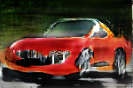
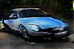
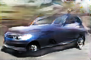
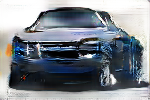
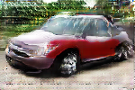

# Car-DCGAN-Keras

* My implementation of a DCGAN in keras with tensorflow.

* The usage is simple, run gan.py to train the generator and discriminator, if you want to generate images, just execute generate.py.
You can create a gif from your training image by executing gif.py.

* training image are in the "car" folder, generated images from generate.py are in the "gen" folder (some exemples are already in the folder), the dataset should be in the "car_img" folder (a few images are in just for exemple, if you want the full dataset, please download : http://ai.stanford.edu/~jkrause/cars/car_dataset.html)  and models are in the "vroum" folder (vroumdis.h5 for the discriminator and vroumgen.h5 for the generator).

